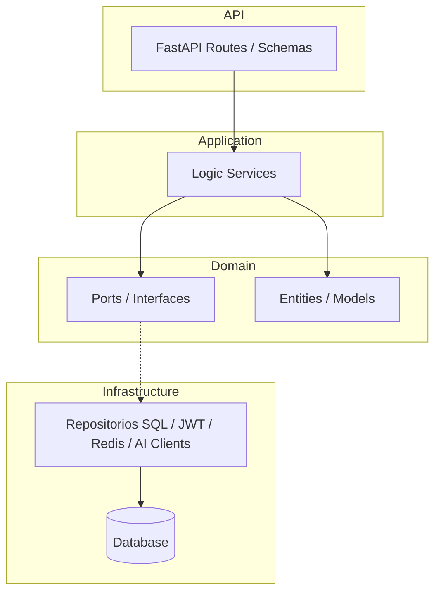

# Mis Eventos - Backend API 🚀

API robusta para la gestión de eventos corporativos, construida con **FastAPI** y siguiendo los principios de la **Arquitectura Hexagonal**.

## 🛠 Tecnologías
- **Lenguaje:** Python 3.12
- **Framework:** FastAPI
- **ORM:** SQLModel (SQLAlchemy + Pydantic)
- **Base de Datos:** PostgreSQL (Producción/Docker) / SQLite (Desarrollo)
- **Gestión de Dependencias:** Poetry
- **Migraciones:** Alembic
- **Pruebas:** Pytest + Coverage
- **Contenerización:** Docker & Docker Compose

---

## 🏗 Arquitectura
El proyecto sigue una **Arquitectura Hexagonal (Puertos y Adaptadores)**:
- **Domain:** Entidades, Enums y Excepciones de negocio (sin dependencias externas).
- **Application:** Servicios que orquestan la lógica de negocio y definen los Puertos (Interfaces).
- **Infrastructure:** Implementaciones concretas de los puertos (Repositorios SQL, Seguridad JWT, etc.).
- **API:** Controladores FastAPI, Schemas de Pydantic y Dependencias.
- **AI Integration:** Capas dedicadas para interacción con LLMs y generación de imágenes.



---

## 🧠 Capacidades de Inteligencia Artificial
El backend integra funcionalidades avanzadas de IA para potenciar la experiencia de usuario y administración:

### 1. 🎨 Generación de Posters con IA
Permite la creación automática de posters para eventos basados en su descripción:
- **Motor Principal:** Pollinations.ai (Modelo Flux) para alta disponibilidad y calidad.
- **Fallback:** Sistema de respaldo con imágenes de Unsplash en caso de errores de red.
- **Seguridad:** Requiere autenticación de usuario.

### 2. 🤖 Admin Intelligence (Chat-to-SQL)
Asistente inteligente exclusivo para administradores que permite consultar la base de datos en lenguaje natural:
- **Motor:** Groq (Llama 3.1 8B Instant) para baja latencia.
- **Flujo:** 
  1. Convierte la pregunta del admin en una consulta SQL optimizada.
  2. Ejecuta la consulta de forma segura en PostgreSQL/SQLite.
  3. Redacta una respuesta humana profesional basada en los datos reales.
- **Requisito:** Configurar `GROQ_API_KEY` en el archivo `.env`.

---

## 🚀 Instalación y Ejecución Local

### Prerrequisitos
- Python 3.12+
- Poetry (`pip install poetry`)

### Pasos
1. **Instalar dependencias:**
   ```bash
   poetry install
   ```
2. **Configurar entorno:**
   Copia el archivo `.env.example` a `.env` y ajusta los valores.
   ```bash
   cp .env.example .env
   ```
3. **Ejecutar migraciones:**
   ```bash
   poetry run alembic upgrade head
   ```
4. **Iniciar servidor:**
   ```bash
   poetry run uvicorn app.main:app --reload --port 8000
   ```

---

## 🐳 Docker
Para ejecutar todo el ecosistema (API + PostgreSQL + Redis):
```bash
docker-compose up --build
```
*Nota: Al iniciar en Docker, el sistema ejecutará automáticamente las migraciones y cargará los datos semilla (usuarios y eventos base) para facilitar las pruebas.*

---

## 🚀 Despliegue en Producción
Para entornos de producción, se recomienda usar **Gunicorn** con trabajadores de **Uvicorn** para manejar múltiples procesos de forma eficiente:

```bash
# Instalar gunicorn si no está presente
poetry add gunicorn

# Iniciar servidor con 4 workers
poetry run gunicorn -w 4 -k uvicorn.workers.UvicornWorker app.main:app --bind 0.0.0.0:8000
```
*Nota: Se recomienda configurar el número de workers como `(2 x núcleos CPU) + 1`.*

---

## 🧪 Pruebas y Calidad de Código
El proyecto utiliza herramientas modernas para asegurar la estabilidad y limpieza del código.

### 1. Pruebas Unitarias (Pytest)
Ejecutar la suite de pruebas unitarias e integración:
```bash
poetry run pytest
```

Para generar un reporte de cobertura:
```bash
poetry run pytest --cov=app tests/
```

### 2. Linting y Formateo (Ruff)
Usamos **Ruff**, el linter y formateador más rápido de Python (reemplaza a Flake8, Isort y Black).
```bash
# Revisar errores de estilo y lógica
poetry run ruff check .

# Corregir errores automáticamente
poetry run ruff check . --fix
```

### 3. Tipado Estático (Mypy)
Para verificar la consistencia de tipos en el proyecto:
```bash
poetry run mypy .
```

---

## 📖 Documentación API
Una vez iniciado el servidor, puedes acceder a:
- **Swagger UI:** [http://localhost:8000/docs](http://localhost:8000/docs)
- **ReDoc:** [http://localhost:8000/redoc](http://localhost:8000/redoc)

---

## 🔑 Autenticación
El sistema utiliza JWT (JSON Web Tokens) con soporte para:
- **Access Token:** 60 minutos de validez.
- **Refresh Token:** 7 días de validez para renovación automática de sesión.
